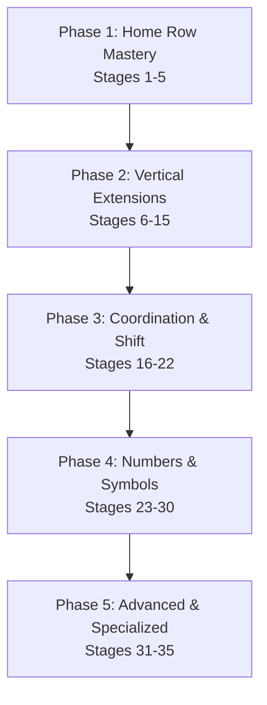

# TypeFlow V2: Touch-Typing Curriculum Design & Competitor Analysis

This document outlines the research, pedagogical framework, and technical specifications for building a world-class touch-typing curriculum and adaptive learning engine for **TypeFlow V2**.

---

## 1. Competitor Curriculum Analysis

To build the best learning system, we analyze how leading platforms introduce keys, structure lessons, handle errors, and motivate users.

### A. TypingClub
*   **Curriculum Structure:** Extremely structured, containing **650+ lessons** in its main English curriculum.
*   **Key Introduction Rate:** Very gradual. It begins with just the index fingers on the home row (`f` and `j`), then introduces `d` and `k`, then `s` and `l`, and finally `a` and `;`. Only after the home row is fully mastered does it move to upper/lower rows, introducing 1–2 keys at a time.
*   **Word Mixing:** Early lessons use simple character repetitions (e.g., `fff jjj`) and pseudo-words (`fjf jfj`), mixing real high-frequency words as soon as enough home row letters are unlocked.
*   **Strengths:** Highly gamified, very accessible (screen readers, voiceovers), excellent visual video guides, and excellent pacing for absolute beginners.
*   **Weaknesses:** Can feel excessively slow and tedious for users who already know basic layouts. The sheer number of lessons (650+) can cause learner fatigue.

### B. Keybr
*   **Adaptive Algorithm:** Starts with a small subset of highly common keys: **E, N, I, T, R, L** (for the English QWERTY layout). It does not follow traditional row-by-row progression. Instead, it uses a statistical model to track:
    1.  **Average typing speed (WPM)** per character.
    2.  **Error rate** per character.
    3.  **Variance / Key strike latency** (how consistently a key is pressed).
*   **Unlock Mechanism:** New keys are introduced one by one from a layout frequency list. A key is only unlocked when the student meets a threshold:
    *   *Confidence score* (calculated via Bayesian inference on error rates and typing speed) for all currently active keys must be high enough (typically matching a target speed of 35+ WPM with < 2% error rate).
*   **Drill Generation:** Keybr generates pseudo-words (e.g., `renin`, `tiler`, `letin`) using Markov chains based on the phonetic rules of the target language. This keeps exercises looking like words while heavily repeating target characters.
*   **Strengths:** Highly efficient; dynamically adapts to individual weak points. Perfect for users looking for fast, targeted improvement.
*   **Weaknesses:** Pseudo-words can feel unnatural, and practicing them doesn't build muscle memory for actual spelling patterns (like English N-Grams). It also lacks structured lessons for numbers, symbols, and shifting.

### C. Typing.com
*   **Curriculum Structure:** Divided into three main stages (Beginner, Intermediate, Advanced) across **~45 core modules**.
*   **Progression:** Home row first (index, middle, ring, pinky), followed by top row, bottom row, Shift/capitalization, and then numbers/symbols.
*   **Drill Types:** A mix of individual character drills, real words, sentences, and paragraphs.
*   **Strengths:** Standards-aligned, excellent school ecosystem integration, includes lessons on digital literacy, coding foundations, and career preparation.
*   **Weaknesses:** Lessons are static and do not adapt dynamically to the user's specific errors.

### D. Monkeytype & Keyhero
*   **Curriculum Structure:** Neither platform has a structured, step-by-step touch-typing curriculum.
*   **Focus:** They are benchmark-first tools.
*   **Learning Value:** They excel at post-test analytics and recovery. Monkeytype tracks missed/slow words and allows users to practice them immediately after a test. Keyhero focuses on real quotes and enforces strict accuracy guidelines.
*   **Strengths:** Exceptional analytics (WPM, Raw WPM, Accuracy, Consistency, Key-by-key latency, Error distribution).
*   **Weaknesses:** Not designed for absolute beginners trying to learn finger placements.

---

## 2. Proposed World-Class Keyboard Progression Sequence

To ensure users build bulletproof muscle memory, TypeFlow V2 will implement a **35-Stage deliberate progression sequence**. Keys are introduced in logical pairs/groups to balance hand usage and focus on finger extensions from the home row.

### The Curriculum Architecture



### Phase 1: Home Row Mastery (Stages 1–5)
Focuses on establishing the anchor position. Fingers must learn to rest and strike on the home row before extending.

*   **Stage 1: Index Anchors**
    *   *Keys Introduced:* `F`, `J`, `Space`
    *   *Target Fingers:* Left Index, Right Index
*   **Stage 2: Middle Row Core**
    *   *Keys Introduced:* `D`, `K`
    *   *Target Fingers:* Left Middle, Right Middle
*   **Stage 3: Ring Row Core**
    *   *Keys Introduced:* `S`, `L`
    *   *Target Fingers:* Left Ring, Right Ring
*   **Stage 4: Pinky Row Core**
    *   *Keys Introduced:* `A`, `;` (semicolon)
    *   *Target Fingers:* Left Pinky, Right Pinky
*   **Stage 5: Home Row Extensions**
    *   *Keys Introduced:* `G`, `H`
    *   *Target Fingers:* Left Index (inner stretch), Right Index (inner stretch)

### Phase 2: Vertical Extensions (Stages 6–15)
Teaches fingers to stretch vertically to the top and bottom rows, always returning to the home row anchor.

*   **Stage 6: Top Row Index Extensions**
    *   *Keys Introduced:* `R`, `U`
    *   *Target Fingers:* Left Index, Right Index
*   **Stage 7: Top Row Middle Extensions**
    *   *Keys Introduced:* `E`, `I`
    *   *Target Fingers:* Left Middle, Right Middle
*   **Stage 8: Top Row Ring Extensions**
    *   *Keys Introduced:* `W`, `O`
    *   *Target Fingers:* Left Ring, Right Ring
*   **Stage 9: Top Row Pinky Extensions**
    *   *Keys Introduced:* `Q`, `P`
    *   *Target Fingers:* Left Pinky, Right Pinky
*   **Stage 10: Bottom Row Index Extensions**
    *   *Keys Introduced:* `V`, `M`
    *   *Target Fingers:* Left Index, Right Index
*   **Stage 11: Bottom Row Middle Extensions**
    *   *Keys Introduced:* `C`, `,` (comma)
    *   *Target Fingers:* Left Middle, Right Middle
*   **Stage 12: Bottom Row Ring Extensions**
    *   *Keys Introduced:* `X`, `.` (period)
    *   *Target Fingers:* Left Ring, Right Ring
*   **Stage 13: Bottom Row Pinky Extensions**
    *   *Keys Introduced:* `Z`, `/` (slash)
    *   *Target Fingers:* Left Pinky, Right Pinky
*   **Stage 14: Top Row Inner Index Extensions**
    *   *Keys Introduced:* `T`, `Y`
    *   *Target Fingers:* Left Index, Right Index
*   **Stage 15: Bottom Row Inner Index Extensions**
    *   *Keys Introduced:* `B`, `N`
    *   *Target Fingers:* Left Index, Right Index

### Phase 3: Coordination, Shift, & Rhythm (Stages 16–22)
Introduces capitalization, finger-specific strengthening, and high-frequency letter combinations.

*   **Stage 16: Capitalization (Left Shift)**
    *   *Keys Introduced:* `Left Shift` (used with right-hand keys: `Y, U, I, O, P, H, J, K, L, N, M`)
    *   *Target Fingers:* Left Pinky holding Shift
*   **Stage 17: Capitalization (Right Shift)**
    *   *Keys Introduced:* `Right Shift` (used with left-hand keys: `Q, W, E, R, T, A, S, D, F, G, Z, X, C, V, B`)
    *   *Target Fingers:* Right Pinky holding Shift
*   **Stage 18: Pinky Power (Left Hand focus)**
    *   *Target Keys:* `Q`, `A`, `Z`, `Left Shift`
    *   *Purpose:* Target coordination and muscle-strengthening of the weakest finger on the non-dominant hand.
*   **Stage 19: Pinky Power (Right Hand focus)**
    *   *Target Keys:* `P`, `;`, `/`, `Right Shift`
    *   *Purpose:* Strengthen right pinky agility and placement.
*   **Stage 20: Ring Finger Rhythm (Left Hand focus)**
    *   *Target Keys:* `W`, `S`, `X`
    *   *Purpose:* Isolate and stabilize ring finger extensions without moving adjacent fingers.
*   **Stage 21: Ring Finger Rhythm (Right Hand focus)**
    *   *Target Keys:* `O`, `L`, `.`
    *   *Purpose:* Improve independence of the right ring finger.
*   **Stage 22: Essential N-Grams**
    *   *Focus Combinations:* `th`, `he`, `in`, `er`, `an`, `re`, `on`, `at`, `es`, `en`
    *   *Purpose:* Transition typing drills focusing on fluid coordination rather than single characters.

### Phase 4: Numbers & Symbols (Stages 23–30)
Integrates the number row and standard punctuation.

*   **Stage 23: Index Number Stretch**
    *   *Keys Introduced:* `4`, `7`, `5`, `6`
    *   *Target Fingers:* Left Index, Right Index
*   **Stage 24: Middle Number Stretch**
    *   *Keys Introduced:* `3`, `8`
    *   *Target Fingers:* Left Middle, Right Middle
*   **Stage 25: Ring Number Stretch**
    *   *Keys Introduced:* `2`, `9`
    *   *Target Fingers:* Left Ring, Right Ring
*   **Stage 26: Pinky Number Stretch**
    *   *Keys Introduced:* `1`, `0`
    *   *Target Fingers:* Left Pinky, Right Pinky
*   **Stage 27: Common Punctuation**
    *   *Keys Introduced:* `'` (apostrophe), `"` (quote), `?` (question mark)
*   **Stage 28: Core Symbols**
    *   *Keys Introduced:* `-` (hyphen/minus), `=` (equal), `+` (plus)
*   **Stage 29: Structural Symbols**
    *   *Keys Introduced:* `[`, `]`, `{`, `}` (brackets and braces)
*   **Stage 30: Code Symbols**
    *   *Keys Introduced:* `<` (less than), `>` (greater than), `\`, `|` (backslash/pipe)

### Phase 5: Advanced & Specialized (Stages 31–35)
Prepares students for real-world scenarios.

*   **Stage 31: The Speed Row**
    *   *Focus:* Real, short high-frequency words containing only letters unlocked in Phases 1 & 2.
*   **Stage 32: Paragraphs and Punctuation**
    *   *Focus:* Proper capitalization, quotation marks, periods, commas, and semi-colons in full sentences.
*   **Stage 33: Coder Drills**
    *   *Focus:* Common programming syntax patterns (e.g., `const user = { id: 1 };`, `if (err) return;`, `std::cout << val;`).
*   **Stage 34: Numbers & Calculations**
    *   *Focus:* Mixed numerical and mathematical typing (e.g., telephone numbers, arithmetic expressions).
*   **Stage 35: Endurance Test**
    *   *Focus:* Long-form prose typing (simulating a novel or long article).

---

## 3. Drill and Word Generation Strategy

Static text leads to muscle memory adaptation to specific sequences rather than the keys themselves. TypeFlow V2 will use a hybrid dynamic generator.

### A. Word Generation Rules per Stage
Each stage uses a generator that constructs drills using three pools of data:
1.  **Focus Keys (60% weight):** The newly introduced keys in the current stage.
2.  **Already Learned Keys (30% weight):** Keys from previous stages, ensuring reviews are continuously integrated.
3.  **Core N-Grams (10% weight):** Common key combinations to build transition muscle memory.

#### Pseudo-Words vs. Real Words
*   **Phases 1 & 2:** Use a mix of pseudo-words (phonetically structured using Markov chains so they are readable but target focus keys, e.g. `dej`, `fef`, `jij`) and real high-frequency words. This is necessary because when only 4 keys are unlocked, the pool of real words is extremely tiny.
*   **Phases 3+:** Transition exclusively to real dictionary words, sentences, and code snippets.

### B. Smart Correction Mechanics

#### 1. Hard Block (No "Ghost Typing")
To prevent users from typing forward after making a mistake (which builds bad muscle memory of recovery keys instead of the target word):
*   When a user hits a wrong key, the input cursor freezes.
*   The wrong character flashes red.
*   The user must hit `Backspace` to clear the mistake before the engine accepts further input.

#### 2. Rhythm Training Metronome (Optional Toggle)
*   **The Problem:** Erratic typing speeds (bursting on easy keys, pausing on hard keys) cause high error rates.
*   **The Solution:** An audio/visual metronome. The user can toggle a beat (e.g., 60, 90, or 120 beats per minute). The UI flashes a subtle line/dot at this rhythm. Users are encouraged to type one key per beat to build steady, relaxed finger movement.

#### 3. Adaptive Missed-Transition Loop
Instead of static repeat loops, the system tracks specific **digram transitions** (key pairs) that the user typed slowly or incorrectly.
*   If the user struggles with the transition `r -> e` (slow speed or multiple typos), the engine logs `re` as a "Weak Transition".
*   At the end of the lesson, a custom mini-drill is dynamically appended.
    *   *Example:* If `re` was the weak transition, the appends would include: `red`, `here`, `were`, `green`, `re-run`.

### C. Lesson Graduation/Exit Criteria
To unlock the next lesson, the user must satisfy *all* of the following conditions:

| Metric | Target Value | Purpose |
| :--- | :--- | :--- |
| **Accuracy** | $\ge 98\%$ | Guarantees precision before speed. |
| **Speed (WPM)** | $\ge 25$ WPM | Confirms the finger placement is memorized. |
| **Maximum Consecutive Errors** | $\le 2$ | Prevents key mashing or guessing. |

*If the user fails to meet these, they must repeat the lesson, or the system drops them into a targeted "correction drill" focusing on their slow keys.*

---

## 4. Visual Guidelines

To keep the user's eyes on the screen (preventing them from looking down at their physical hands), the UI must provide clear visual guidance.

```
+-------------------------------------------------------------+
|  The quick brown fox jumps over the lazy dog                |
|  [__Cursor__]                                               |
+-------------------------------------------------------------+
|                                                             |
|   [ Q ] [ W ] [ E ] [ R ] [ T ]    [ Y ] [ U ] [ I ] [ O ]   |
|   [ A ] [ S ] [ D ]*[ F ] [ G ]    [ H ]*[ J ] [ K ] [ L ]   |
|     [ Z ] [ X ] [ C ] [ V ] [ B ]    [ N ] [ M ] [ , ]       |
|                                                             |
|           Left Hand                    Right Hand           |
|            (   )                         (   )              |
|           / / \ \                       / / \ \             |
|          ( ) ( ) *                       * ( ) ( )          |
+-------------------------------------------------------------+
```

### Essential UI Elements

1.  **Virtual Keyboard Heatmap/Coloring:**
    *   Color-code keys by the finger assigned to type them (e.g., Index keys in Blue, Middle in Green, Ring in Yellow, Pinky in Red/Orange).
    *   When a key is active, highlight both the key on the virtual keyboard and its corresponding finger zone.
2.  **Floating Visual Hands Overlay:**
    *   Display a subtle outline of two hands at the bottom of the typing window.
    *   When a character needs to be typed, place a glowing indicator dot on the specific finger responsible for that key (e.g., a pulsing dot on the right ring finger for `o`).
3.  **Active Key Highlight:**
    *   Make the next character in the typing target display with a subtle zoom/bounce animation.
    *   The corresponding key on the virtual keyboard should glow.
4.  **Error Feedback Animations:**
    *   When an error occurs, do not just make it red. Shake the cursor slightly, or pulse the correct physical key on screen to guide the user back to the correct track.
