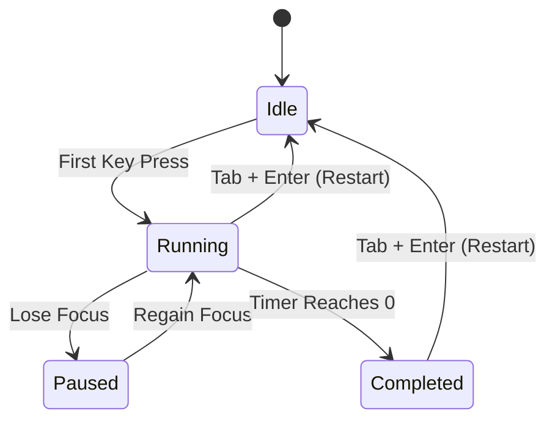

# Typing Engine Specification
## Project: TypeFlow (Phase 1 MVP)

**Last updated**: 2026-06-07  
**Author**: Typing Engine Specialist  
**Status**: Draft (Sprint 1 Specs)

---

## 1. Core Mechanics & State Management

The typing engine maintains a state machine representing the active test.



### Engine State Variables
* `wordList`: Array of strings (e.g., `["the", "quick", "brown", "fox"]`).
* `currentWordIndex`: Integer pointing to active word.
* `currentCharIndex`: Integer pointing to target character in the active word.
* `keystrokeBuffer`: Array of characters representing the current word input.
* `startTime`: Timestamp (ms) when the first key is pressed.
* `endTime`: Timestamp (ms) when the timer expires.
* `totalKeystrokes`: Integer tracking all key presses (excluding modifier keys like Shift).
* `correctKeystrokes`: Integer tracking keys typed that matched the target.
* `errorLog`: List of errors containing `{ wordIndex, charIndex, expected, actual, timestamp }`.
* `keystrokeTimeDeltas`: Array of timestamps (ms) for calculating cadence.

---

## 2. Key Input Handling & Backspace Rules

### Input Logic
The engine monitors keydown events. The active key input must be compared against the target letter at `wordList[currentWordIndex][currentCharIndex]`.

* **Letter Keys (a-z, punctuation)**:
  * Compare input key with target character.
  * If correct: Advance `currentCharIndex` by 1. Increment `correctKeystrokes`. Mark character as typed-correct.
  * If incorrect: Advance `currentCharIndex` by 1. Record error in `errorLog`. Mark character as typed-error.
  * Add keypress to `totalKeystrokes`.
* **Spacebar (` `)**:
  * Triggered when space is pressed at the end of the word or to skip.
  * **Rule**: Pressing Spacebar locks the current word and advances `currentWordIndex` by 1. Reset `currentCharIndex` to 0.
  * Users cannot press Spacebar if they haven't typed anything in the current word yet.
* **Backspace (`Backspace`)**:
  * **Boundary Rule**: Users are allowed to backspace within the **current word** only.
  * Once the spacebar is pressed to advance to the next word, the previous word is committed/locked. The user **cannot** backspace into previous words. This is standard in Keybr and 10FastFingers and keeps the state logic highly performant and bug-free for the MVP.
  * If `currentCharIndex > 0`, decrement `currentCharIndex` by 1, clear the character status in the buffer, and slide the caret back.

---

## 3. Metric Calculations

To ensure absolute consistency and trust, all calculations follow these standard definitions:

### A. Raw WPM (Gross Speed)
Calculated as the total number of keystrokes divided by 5 (the standard word length), divided by the duration in minutes.
$$\text{Raw WPM} = \frac{\text{Total Keystrokes} / 5}{\text{Duration in Seconds} / 60}$$
* *Example*: A user types 300 characters in 60 seconds. Raw WPM = $(300 / 5) / 1.0 = 60\text{ WPM}$.

### B. Net WPM (Adjusted Speed)
Calculated as correct keystrokes divided by 5, divided by duration in minutes. Correct keystrokes are keystrokes that match the target letters at the end of the test.
$$\text{WPM} = \frac{\text{Correct Keystrokes} / 5}{\text{Duration in Seconds} / 60}$$
* *Example*: Out of 300 characters, 280 are correct and 20 are errors. Net WPM = $(280 / 5) / 1.0 = 56\text{ WPM}$.

### C. Keystroke Accuracy (%)
Calculated as the ratio of correct keystrokes to total key inputs.
$$\text{Accuracy (\%)} = \left( \frac{\text{Correct Keystrokes}}{\text{Total Keystrokes}} \right) \times 100$$
* *Example*: $(280 / 300) \times 100 = 93.33\%$.

---

## 4. Keystroke Cadence Logging (Data Engineering Event)

To support future data analytics use cases, the engine logs the exact time of every keystroke. This allows measuring typing rhythm (e.g., how much slower a user types `q` compared to `e`).

For each valid character keypress, log:
```json
{
  "key": "f",
  "target": "f",
  "wordIndex": 0,
  "charIndex": 3,
  "timestamp": 1717719600125,
  "deltaMs": 120,
  "status": "correct"
}
```
`deltaMs` is calculated as `current_keystroke_time - previous_keystroke_time`. If it is the first character of the test, `deltaMs` is set to `0`.

---

## 5. Test Fixtures (QA Verification Cases)

These fixtures will be implemented in unit tests using **Vitest** to verify the engine before building UI components.

### Fixture 1: Perfect 60-Second Run
* **Input**:
  * Words: `["the", "quick", "brown"]`
  * Typed Keystrokes: `t-h-e-[space]-q-u-i-c-k-[space]-b-r-o-w-n` (Total: 15 keystrokes)
  * Time: 15 seconds (0.25 minutes)
* **Expected Output**:
  * Total Keystrokes = 15, Correct Keystrokes = 15.
  * Raw WPM = $(15 / 5) / 0.25 = 12\text{ WPM}$.
  * Net WPM = $(15 / 5) / 0.25 = 12\text{ WPM}$.
  * Accuracy = $100\%$.

### Fixture 2: Run with Uncorrected Errors
* **Input**:
  * Words: `["the", "quick", "brown"]`
  * Typed Keystrokes: `t-h-a-[space]-q-u-i-c-k-[space]-b-r-o-w-n` (Total: 15 keystrokes; typed `a` instead of `e` in `the`)
  * Time: 15 seconds (0.25 minutes)
* **Expected Output**:
  * Total Keystrokes = 15, Correct Keystrokes = 14.
  * Raw WPM = $(15 / 5) / 0.25 = 12\text{ WPM}$.
  * Net WPM = $(14 / 5) / 0.25 = 11.2\text{ WPM}$.
  * Accuracy = $(14 / 15) \times 100 = 93.33\%$.

### Fixture 3: Run with Corrected Errors (Backspace Used)
* **Input**:
  * Words: `["the"]`
  * Typed Keystrokes: `t-h-a-[backspace]-e` (Total: 5 keystrokes; corrected `a` to `e`)
  * Time: 5 seconds (0.0833 minutes)
* **Expected Output**:
  * Total Keystrokes = 5 (all key presses count).
  * Correct Keystrokes = 3 (the resulting characters `t`, `h`, `e` at the end are correct).
  * Raw WPM = $(5 / 5) / 0.0833 = 12\text{ WPM}$.
  * Net WPM = $(3 / 5) / 0.0833 = 7.2\text{ WPM}$.
  * Accuracy = $(3 / 5) \times 100 = 60\%$.
