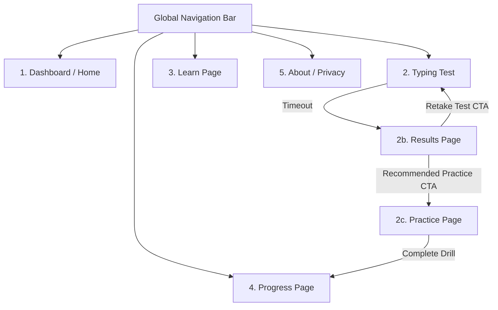

# UX Flow Map & Navigation Specification
## Project: TypeFlow (Phase 1 MVP)

**Last updated**: 2026-06-07  
**Author**: UX Designer  
**Status**: Draft (Sprint 1 Specs)

---

## 1. Page Map & Navigation Hierarchy

TypeFlow utilizes a simple multi-page routing structure. Because the application is local-first and built as a React Single-Page Application (SPA) via Vite, route transitions are instantaneous.

### Global Header Layout
* **Left**: TypeFlow logo + logo text (clicking returns to Dashboard).
* **Center**: Minimal text links (`Test`, `Learn`, `Progress`, `About`).
* **Right**: Theme toggle (Dark/Light/Sepia icon) + Sound volume toggle.

---

## 2. Core User Flows

### Flow A: Test to Results to Practice Loop (Primary Engine Flow)
1. **Entry**: User lands on the Dashboard or clicks `Test`.
2. **Setup**: User optionally selects duration (15s, 30s, 60s). Default 60s is pre-selected.
3. **Execution**: User clicks the text box or presses any character key to start.
   * Timer counts down.
   * Typed words slide smoothly from right to left.
4. **Trigger**: Timer hits 0 seconds.
5. **Redirect**: Instantly transition to the **Results Page**.
6. **Interaction**: User views their score and reads the recommendation.
7. **Action**: User clicks the prominent "Practice Weak Words" primary CTA.
8. **Drill**: Redirects to the **Practice Page** pre-loaded with the failed words list.
9. **Exit**: Completing the practice list redirects the user to the **Progress Page** to see their updated stats.

---

## 3. Keyboard-First Interaction & Shortcuts

To support competitive typists and maintain a fast workflow, mouse interactions are entirely optional.

| Shortcut | Action | Scope |
|---|---|---|
| `Tab` + `Enter` | Instantly restarts the current typing test. | Typing Test, Results |
| `Esc` | Unfocuses the typing input, showing the Pause overlay. | Typing Test, Practice |
| `Ctrl` + `Alt` + `t` | Navigates immediately to the **Typing Test** page. | Global |
| `Ctrl` + `Alt` + `d` | Navigates immediately to the **Dashboard**. | Global |
| `Ctrl` + `Alt` + `p` | Navigates immediately to the **Progress** page. | Global |
| `Ctrl` + `Alt` + `l` | Navigates immediately to the **Learn** page. | Global |

---

## 4. Visual States & Feedback Details

### A. Active vs Unfocused Test
To prevent timer leaks when the user is distracted:
* **Active State**: Input field has focus. The text is sharp and highly readable.
* **Unfocused State (Pause)**: If the user clicks away from the browser window or hits `Esc`:
  * Overlay displays: `"Test Paused. Click here or press any key to resume."`
  * Timer freezes.
  * Input text is blurred via a CSS filter: `filter: blur(4px)`.

### B. Typo Feedback Styling
* **Untyped characters**: Subdued gray (color: `#64748b` in dark mode).
* **Correctly typed characters**: Clean white/neutral (color: `#f8fafc`).
* **Mistakes (Active Typo)**: Bright orange/red with a subtle underline (color: `#ef4444`).
* **Caret**: A vertical accent line (color: `#e2e8f0`) that blinks at a rate of 1Hz when idle, and becomes static during typing.

---

## 5. Responsive Design & Viewport Adjustments

While typing tests require a physical keyboard, the site should remain beautiful on all screens:

### Mobile Viewports (width < 768px)
* Navigation bar collapses into a hamburger menu or neat footer tabs.
* If the user accesses the **Typing Test** page on mobile:
  * A warning banner is displayed: `"Physical keyboard recommended. To type on mobile, tap here to open the virtual keyboard."`
  * The virtual keyboard text input helper is loaded dynamically to capture keystroke events on mobile.
* Charts on the **Progress** page collapse from a wide line chart into vertical cards or compact sparklines.
