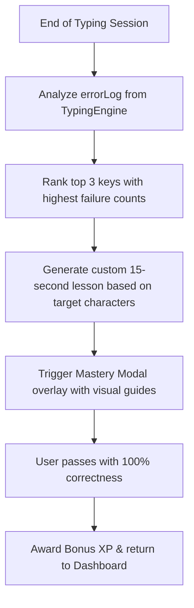

# TypeFlow: Product Enhancement Blueprint & Technical Audit

This blueprint evaluates the current architecture of **TypeFlow**, identifies key experience leaks and technical loopholes, and designs concrete local-first solutions to drive user retention, engagement, and precision training.

---

## 1. Product & Architecture Gap Analysis

An audit of the current codebase reveals several critical UX and technical loopholes that lower user retention and limit the educational effectiveness of the platform:

| Core Area | Current Implementation | UX / Technical Loophole | Impact | Strategic Priority |
| :--- | :--- | :--- | :--- | :--- |
| **Daily Retention** | Lessons and test sessions are logged to IndexedDB, but there is no streak tracking, user profiles, or leveling system. | **Dead-End Sessions:** Once a user completes a lesson, there is no pull to return tomorrow. Sessions feel disconnected. | High drop-off after 1-2 days of initial usage. | **Critical** (P0) |
| **Visual Reward Loops** | Standard CSS styling. No animations on correct/incorrect inputs; no progression-based styling. | **Visual Fatigue:** Typing feels clinical. The lack of visual gratification (e.g., animations, unlockable cosmetics) fails to trigger dopamine response. | Users search for more "exciting" alternatives like Monkeytype. | **High** (P1) |
| **Error Feedback & Recovery** | Hard-locked typing loop: users must press `Backspace` to clear errors before continuing. | **Unstructured Failure:** Errors are logged, but the application does not utilize them. The user moves on without resolving the muscle-memory block. | Users repeat the same mistakes indefinitely without targeted correction. | **High** (P1) |
| **Performance Heatmaps** | Accuracy heatmap tracks which characters were missed. | **Latency Blindspot:** A user might have 100% accuracy on a key transition but take 500ms (a "muscle-memory pause") to find it. This latency goes unmapped. | Advanced users cannot identify speed bottlenecks in their keystroke cadence. | **Medium** (P2) |
| **Audio Feedback** | Primitive toggle for mechanical key clicks (binary true/false sound configuration). | **Acoustic Monotony:** Monotonous click sounds do not mimic the satisfying acoustic variety of actual mechanical keyboard switches (clicky, tactile, linear). | Reduced sensory immersion. | **Medium** (P2) |

---

## 2. Technical Implementation Diffs & Outlines

To address these gaps, we propose upgrading the **TypeFlowDB** schema from Version 2 to Version 3, introducing local-first tracking for streaks, XP/levels, achievements, and keystroke transition latencies.

### A. Dexie.js Schema Upgrade Outline (`src/services/db.ts`)

Here is the proposed diff to modify [db.ts](file:///c:/Users/ATPLGCC0569/Downloads/TypeFlow-main/TypeFlow-main/src/services/db.ts) to define a Version 3 schema, introducing tables for `userStats` (to hold streaks, XP, level, unlocked themes) and `keystrokeCadence` (to log key-to-key latency data):

```diff
  export interface LessonAttempt {
    id?: number;
    lessonId: number;
    completedAt: Date;
    errorsCount: number;
    durationSeconds: number;
  }
  
+ export interface UserStats {
+   id?: string; // e.g. "current_user"
+   xp: number;
+   level: number;
+   currentStreak: number;
+   longestStreak: number;
+   lastActiveTimestamp: number;
+   unlockedThemes: string[];
+   activeTheme: string;
+ }
+ 
+ export interface KeystrokeCadence {
+   id?: number;
+   fromKey: string;
+   toKey: string;
+   latencyMs: number;
+   timestamp: number;
+ }
  
  export class TypeFlowDB extends Dexie {
    tests!: Table<TypingTestSession, number>;
    personalBests!: Table<PersonalBest, number>;
    lessons!: Table<LessonAttempt, number>;
+   userStats!: Table<UserStats, string>;
+   cadence!: Table<KeystrokeCadence, number>;
  
    constructor() {
      super('TypeFlowDB');
      
      // Version 1 (Backwards compatibility)
      this.version(1).stores({
        tests: '++id, timestamp, duration, wpm, accuracy',
        personalBests: 'duration, wpm, timestamp'
      });
  
      // Version 2 (Adding lessons attempt tracking)
      this.version(2).stores({
        tests: '++id, timestamp, duration, wpm, accuracy',
        personalBests: 'duration, wpm, timestamp',
        lessons: '++id, lessonId, completedAt'
      });
+ 
+     // Version 3 (Adding Gamification & Cadence Latency metrics)
+     this.version(3).stores({
+       tests: '++id, timestamp, duration, wpm, accuracy',
+       personalBests: 'duration, wpm, timestamp',
+       lessons: '++id, lessonId, completedAt',
+       userStats: 'id',
+       cadence: '++id, [fromKey+toKey], timestamp'
+     });
    }
  }
```

### B. Core Local-First Algorithms

#### 1. Daily Streak Calculator (Local Timestamps)
This local-first function computes and increments the user's active streak based on lesson/test timestamps, checking for consecutive calendar days in the user's timezone.

```typescript
export async function updateDailyStreak(): Promise<{ currentStreak: number; streakUpdated: boolean }> {
  return db.transaction('rw', db.userStats, async () => {
    let stats = await db.userStats.get('current_user');
    const now = new Date();
    
    // Normalize date to midnight for comparison
    const today = new Date(now.getFullYear(), now.getMonth(), now.getDate()).getTime();
    const oneDayMs = 24 * 60 * 60 * 1000;
    
    if (!stats) {
      stats = {
        id: 'current_user',
        xp: 0,
        level: 1,
        currentStreak: 1,
        longestStreak: 1,
        lastActiveTimestamp: today,
        unlockedThemes: ['dark', 'light', 'sepia'],
        activeTheme: 'dark'
      };
      await db.userStats.put(stats);
      return { currentStreak: 1, streakUpdated: true };
    }

    const lastActiveDate = new Date(stats.lastActiveTimestamp);
    const lastActiveMidnight = new Date(lastActiveDate.getFullYear(), lastActiveDate.getMonth(), lastActiveDate.getDate()).getTime();
    
    const diffMs = today - lastActiveMidnight;
    let newStreak = stats.currentStreak;
    let updated = false;

    if (diffMs === oneDayMs) {
      // Consecutive day active
      newStreak += 1;
      updated = true;
    } else if (diffMs > oneDayMs) {
      // Streak broken, reset to 1
      newStreak = 1;
      updated = true;
    }

    if (updated || stats.lastActiveTimestamp !== today) {
      stats.currentStreak = newStreak;
      stats.longestStreak = Math.max(stats.longestStreak, newStreak);
      stats.lastActiveTimestamp = today;
      await db.userStats.put(stats);
    }

    return { currentStreak: stats.currentStreak, streakUpdated: updated };
  });
}
```

#### 2. Experience Points (XP) & Leveling Formula
To compute dynamic XP rewards and trigger level-ups:

$$\text{XP Earned} = \text{Math.round} \left( \text{WPM} \times \left( \frac{\text{Accuracy}}{100} \right)^2 \times \frac{\text{DurationSeconds}}{10} \right)$$

*Squaring accuracy penalizes poor technique heavily (e.g. 80% accuracy outputs $0.64$ multiplier, while 100% outputs $1.0$).*

```typescript
export function calculateXPEarned(wpm: number, accuracy: number, durationSeconds: number): number {
  const accuracyMultiplier = Math.pow(accuracy / 100, 2);
  const timeFactor = durationSeconds / 10;
  return Math.round(wpm * accuracyMultiplier * timeFactor);
}

export async function addXP(amount: number): Promise<{ levelUp: boolean; newLevel: number; totalXp: number }> {
  return db.transaction('rw', db.userStats, async () => {
    let stats = await db.userStats.get('current_user');
    if (!stats) {
      stats = {
        id: 'current_user',
        xp: 0,
        level: 1,
        currentStreak: 0,
        longestStreak: 0,
        lastActiveTimestamp: 0,
        unlockedThemes: ['dark', 'light', 'sepia'],
        activeTheme: 'dark'
      };
    }
    
    stats.xp += amount;
    
    // Level Up Threshold: Level = Math.floor(Math.sqrt(XP / 100)) + 1
    // Meaning Lvl 2 needs 100XP, Lvl 3 needs 400XP, Lvl 4 needs 900XP...
    const calculatedLevel = Math.floor(Math.sqrt(stats.xp / 100)) + 1;
    const levelUp = calculatedLevel > stats.level;
    
    if (levelUp) {
      stats.level = calculatedLevel;
    }
    
    await db.userStats.put(stats);
    return { levelUp, newLevel: stats.level, totalXp: stats.xp };
  });
}
```

---

## 3. High-Impact Retention Feature Proposals

### Feature 1: Adaptive Mastery Drill (Mistake Correction Loop)
* **Objective:** Extract user errors at the end of typing sessions, design personalized corrective practice drills, and eliminate the frustration of backspace-locking on repeated mistakes.



* **Targeted Implementation:**
  1. Retrieve `errorLog` containing expected and typed characters.
  2. Map key frequency errors. For instance, if a user misses keys `p`, `x`, and `b` the most:
     * Generate dynamic drill blocks mixing these keys with comfortable letters: `pop box bob pap box box pbp bxb`.
  3. Launch a 15-second micro-drill instantly before routing back to the dashboard. Passing the drill clears "mistake debt" and grants bonus XP.

---

### Feature 2: Mechanical Switch Soundscapes & Micro-Animations
* **Objective:** Elevate typing feedback into a tactile-acoustic feedback loop, mimicking physical keyboard behaviors and rewarding successful keystrokes.

* **Audio Profiles:**
  * **Blue Switch (Clicky):** Sharp, crisp, high-frequency auditory clicks.
  * **Brown Switch (Tactile):** Rounded, deeper mechanical clack.
  * **Red Switch (Linear):** Quiet, low-pitch thud.

* **Visual Micro-Animations (CSS):**
  Add visual feedback to keys as they are processed.
  
```css
/* Keystroke Pop Animation for correctly hit letters */
.char-correct-pop {
  animation: keyPop 0.15s cubic-bezier(0.175, 0.885, 0.32, 1.275);
}

@keyframes keyPop {
  0% {
    transform: scale(0.9);
    color: var(--accent-color);
  }
  50% {
    transform: scale(1.15);
    text-shadow: 0 0 8px var(--accent-glow);
  }
  100% {
    transform: scale(1);
  }
}

/* Caret Breathing / Ghost Guide */
.ghost-caret {
  border-left: 2px solid var(--primary-accent);
  animation: caretBlink 1s infinite alternate;
}

@keyframes caretBlink {
  0% { opacity: 0.2; }
  100% { opacity: 1.0; }
}
```

---

### Feature 3: Local-First Streaks & Custom Themes Engine
* **Objective:** Drive daily visits through gamified milestones, offering a GitHub-style contribution grid of typing frequency and cosmetic theme unlocks.

* **Milestone Achievements & Unlock Config:**
  ```typescript
  export interface ThemeUnlockMilestone {
    themeId: string;
    displayName: string;
    requirementLabel: string;
    checkUnlock: (stats: UserStats, history: TypingTestSession[]) => boolean;
  }

  export const THEME_UNLOCKS: ThemeUnlockMilestone[] = [
    {
      themeId: 'cyberpunk',
      displayName: 'Cyberpunk 2077',
      requirementLabel: 'Reach a level of 5 and complete a 3-day streak',
      checkUnlock: (stats) => stats.level >= 5 && stats.currentStreak >= 3
    },
    {
      themeId: 'retro-terminal',
      displayName: 'Retro 80s Terminal',
      requirementLabel: 'Achieve 70 WPM in any typing test',
      checkUnlock: (_, history) => history.some(test => test.wpm >= 70)
    },
    {
      themeId: 'forest-green',
      displayName: 'Forest Grove',
      requirementLabel: 'Complete 25 lessons successfully',
      checkUnlock: (stats) => false // evaluated by querying db.lessons count
    }
  ];
  ```

* **Theme Cosmetics Engine:**
  Unlockable themes can be mapped to custom root CSS variables. For instance, the **Cyberpunk** theme modifies variables dynamically:
  ```css
  [data-theme="cyberpunk"] {
    --bg-color: #0b0c10;
    --text-color: #00ffcc;
    --accent-color: #ff007f;
    --accent-glow: rgba(255, 0, 127, 0.4);
    --keyboard-bg: #1f2833;
  }
  ```

---

## 4. Competitive Market Analysis

To distinguish TypeFlow in a saturated market (Keybr, Monkeytype, Duolingo, EdClub):

1. **Monkeytype vs. TypeFlow:** While Monkeytype is the gold standard for custom timers and developer themes, it lacks structured curriculum progression. TypeFlow wins by providing a guided, touch-typing curriculum with smart diagnostic lessons.
2. **Keybr vs. TypeFlow:** Keybr is heavily math-based and uses pseudo-words which feel abstract and tiring. TypeFlow implements a gamified SaaS approach with tangible XP levels, unlocking themes, and adaptive English vocabulary drills.
3. **Local-First Privacy Standard:** Unlike traditional typing platforms that track clicks, profile details, and telemetry back to a centralized cloud database, TypeFlow is 100% private, offline-capable, and hosted at zero platform cost. This makes it an ideal fit for privacy-conscious developers and corporate setups.
